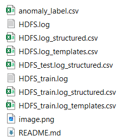

# AVANT EXECUTION DE data.ipjynb et project_parser.py

- Une fois que le projet est telechargé, ce folder doit contenir que "anomaly_label.csv".
- La prochaine etape est de telechargé le fichier log ´HDFS.log´ depuis : https://github.com/logpai/loghub/tree/master.
- Et mettre ce dernier dans ce folder.
- Maintenant vous executez les cellules de data.ipynb et apres project_parser.py

# APRES EXECUTION

- Apres execution, vous obtenez comme image dessus :

